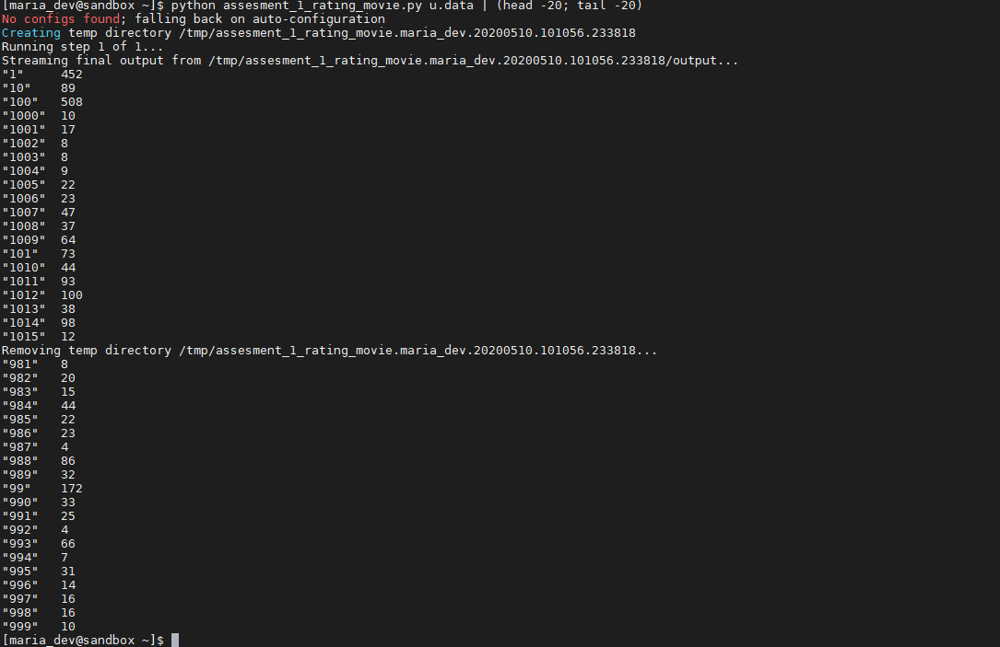
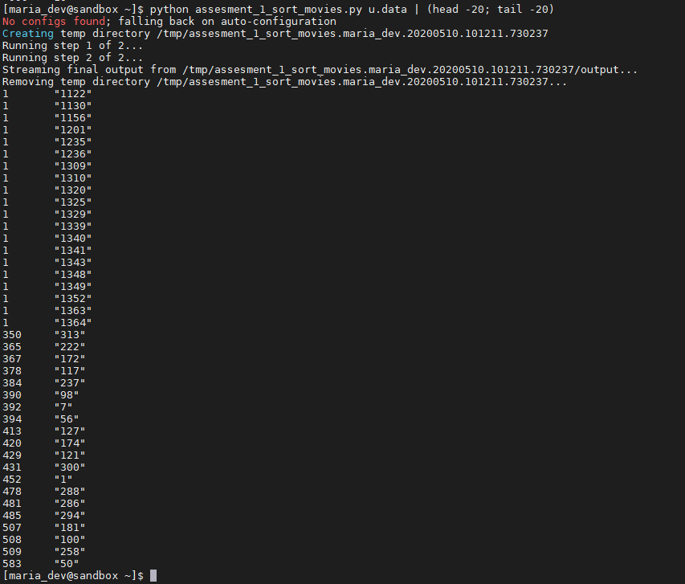

# PDP Assignment 1

### Assignment 1.1
-------------

assesment_1_rating_movie.py:

- Count the number of ratings given for each movie 
- Code have to run on HDFS with a basic setup (Lecture 1 & 2) 
- Code is executed with a python command with MrJob

### Assignment 1.2
-------------

assesment_1_sort_movies:
(Additional to assesment 1)
- Sort the movies by their numbers of ratings

# HOW TO RUN

We expect you have a Hadoop VM running as you learned during Micha's class.

- SSH in the vm `ssh maria_dev@127.0.0.1 -p 2222`
- clone this github repo: 'git@github.com:Jobvermeulen/ParallelDistributedProcessing.git`
- cd into the folder `cd ParallelDistributedProcessing/assignment1`
- execute script for assignment 1: `python assesment_1_rating_movie.py u.data`
- execute script for assignment 1.2: `python assesment_1_sort_movies.py u.data`

# Results

### Assignment 1

### Assignment 1.2

